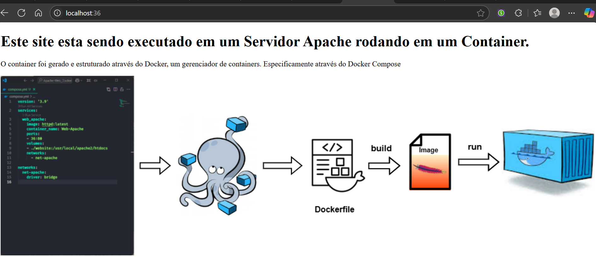
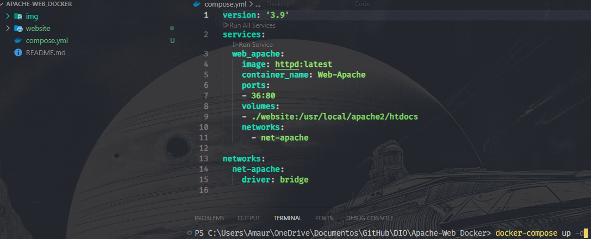
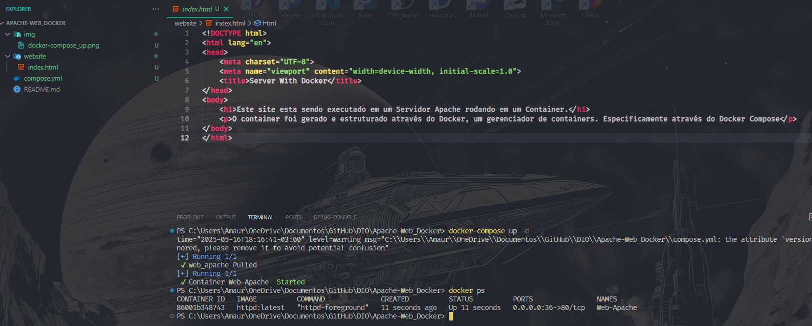

# Apache-Web_Docker
Neste projeto utiliza-se o Docker Compose para executar uma aplicação HTML em um Container Apache.

## Web Server Apache

## Execute docker-compose up -d

## Container Running
